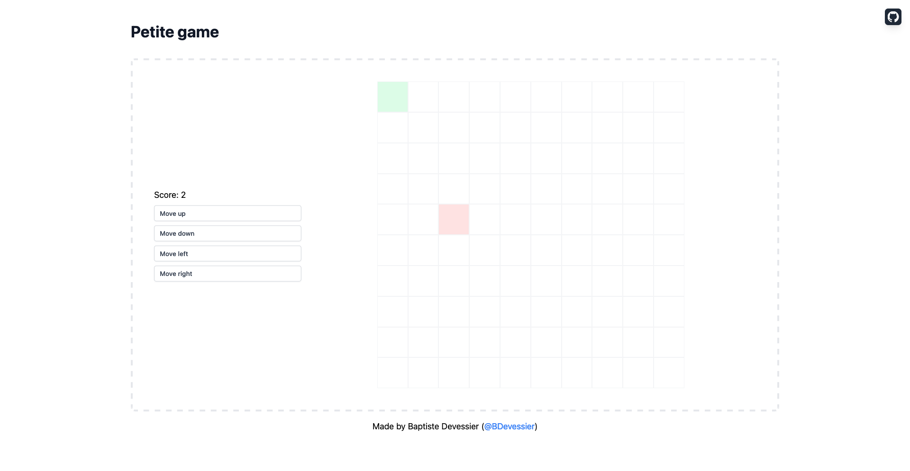

# AdonisJS + Petite Vue + XState

A little game to demonstrate how XState can be used front-end with a back-end framework such as Laravel, Ruby on Rails or AdonisJS, that renders plain HTML pages, and where JavaScript is only used to enhance them.

## The Game

The green square needs to be moved to the red square to win the game. There are four buttons, to move the green square up, right, down and left.

When a game is won, another one can be started. The score is incremented.

## The Stack

### TL;DR

[See XState machine →](https://github.com/Devessier/adonisjs-petitevue-xstate/blob/651931275dc7612f0a2672ff12ef5742a9c41971/resources/js/game-machine.js#L3)

[See machine interpreting and `petite-vue` setup →](https://github.com/Devessier/adonisjs-petitevue-xstate/blob/f878091e5663af43f3f22a12c5b6e82387ca3938/resources/js/app.js)

[See template page →](https://github.com/Devessier/adonisjs-petitevue-xstate/blob/f878091e5663af43f3f22a12c5b6e82387ca3938/resources/views/welcome.edge)

### Explanation

[AdonisJS](https://adonisjs.com/) renders server-side a plain HTML page thanks to its [template engine](https://docs.adonisjs.com/guides/views/introduction).

The logic of the game is driven by a [XState machine](https://github.com/Devessier/adonisjs-petitevue-xstate/blob/651931275dc7612f0a2672ff12ef5742a9c41971/resources/js/game-machine.js#L3).

[`petite-vue`](https://github.com/vuejs/petite-vue) is used to add reactivity to the plain HTML page. We [`interpret` the machine and we create a `reactive` object](https://github.com/Devessier/adonisjs-petitevue-xstate/blob/651931275dc7612f0a2672ff12ef5742a9c41971/resources/js/app.js#L6-L19) that contains the current state of the machine and a function to send events to it. This reactive object is [attached to the `petite-vue` instance](https://github.com/Devessier/adonisjs-petitevue-xstate/blob/651931275dc7612f0a2672ff12ef5742a9c41971/resources/js/app.js#L21-L23) and can be used everywhere in the page.

[The board](https://github.com/Devessier/adonisjs-petitevue-xstate/blob/651931275dc7612f0a2672ff12ef5742a9c41971/resources/views/welcome.edge#L23-L35) is built server-side by AdonisJS, but styles for green and red squares are added client-side, [according to values of the context of the machine](https://github.com/Devessier/adonisjs-petitevue-xstate/blob/651931275dc7612f0a2672ff12ef5742a9c41971/resources/views/welcome.edge#L29).

[Buttons are constructed server-side](https://github.com/Devessier/adonisjs-petitevue-xstate/blob/651931275dc7612f0a2672ff12ef5742a9c41971/resources/views/welcome.edge#L12-L19) too, and in the expression for the `@click` attribute, executed when the button is clicked, we send an event to the machine, whose name is the label of the button, known server-side.

When the game is finished, a [modal is displayed](https://github.com/Devessier/adonisjs-petitevue-xstate/blob/f878091e5663af43f3f22a12c5b6e82387ca3938/resources/views/welcome.edge#L38-L71) to ask if another game should be started. The modal is displayed [when the current state is `Won game`](https://github.com/Devessier/adonisjs-petitevue-xstate/blob/f878091e5663af43f3f22a12c5b6e82387ca3938/resources/views/welcome.edge#L38). The game is restarted when [the button on the modal is clicked](https://github.com/Devessier/adonisjs-petitevue-xstate/blob/f878091e5663af43f3f22a12c5b6e82387ca3938/resources/views/welcome.edge#L64).

## Development

Follow those steps to launch the application on your computer:

1. Clone the repository
2. Install dependencies: `npm install`
3. Create `.env` file at the root from the content of `.env.example`
4. Launch AdonisJS development server: `npm run dev`
5. Visit development server at [localhost:3333](http://localhost:3333)

## Credits

I thank all the contributors of the awesome tools I used for this project:

- [XState](https://xstate.js.org/docs/)
- [AdonisJS](https://adonisjs.com/)
- [`petite-vue`](https://github.com/vuejs/petite-vue)
- [Tailwind CSS](https://tailwindcss.com/)
- [Tailwind UI](https://tailwindui.com/)
- [Clever Cloud (for deployment)](https://clever-cloud.com/)
